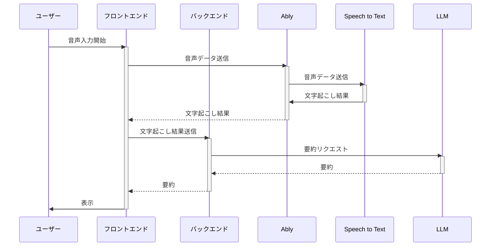

# シーケンス図

```mermaid
sequenceDiagram
    participant ユーザー
    participant フロントエンド
    participant バックエンド
    participant Ably
    participant Speech to Text
    participant LLM

    ユーザー->>フロントエンド: 音声入力開始
    activate フロントエンド
    フロントエンド->>Ably: 音声データ送信
    activate Ably
    Ably->>Speech to Text: 音声データ送信
    activate Speech to Text
    Speech to Text->>Ably: 文字起こし結果
    deactivate Speech to Text
    Ably-->>フロントエンド: 文字起こし結果
    deactivate Ably
    フロントエンド->>バックエンド: 文字起こし結果送信
    activate バックエンド
    バックエンド->>LLM: 要約リクエスト
    activate LLM
    LLM-->>バックエンド: 要約
    deactivate LLM
    バックエンド-->>フロントエンド: 要約
    deactivate バックエンド
    フロントエンド->>ユーザー: 表示
    deactivate フロントエンド
```
