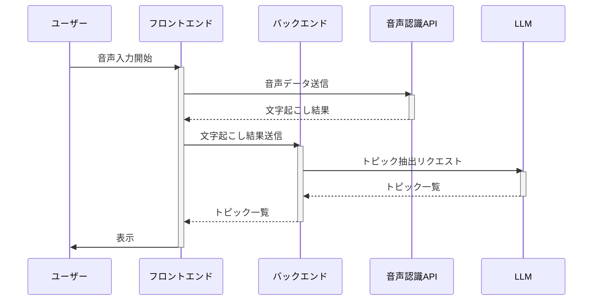

# シーケンス図

```mermaid
sequenceDiagram
    participant ユーザー
    participant フロントエンド
    participant バックエンド
    participant 音声認識API
    participant LLM

    ユーザー->>フロントエンド: 音声入力開始
    activate フロントエンド
    フロントエンド->>音声認識API: 音声データ送信
    activate 音声認識API
    音声認識API-->>フロントエンド: 文字起こし結果
    deactivate 音声認識API
    フロントエンド->>バックエンド: 文字起こし結果送信
    activate バックエンド
    バックエンド->>LLM: トピック抽出リクエスト
    activate LLM
    LLM-->>バックエンド: トピック一覧
    deactivate LLM
    バックエンド-->>フロントエンド: トピック一覧
    deactivate バックエンド
    フロントエンド->>ユーザー: 表示
    deactivate フロントエンド
```
